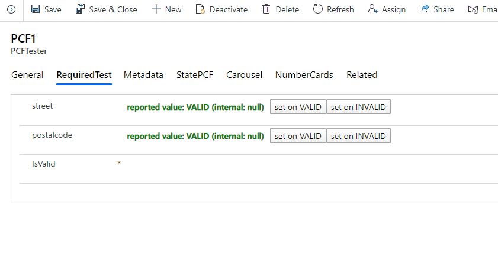
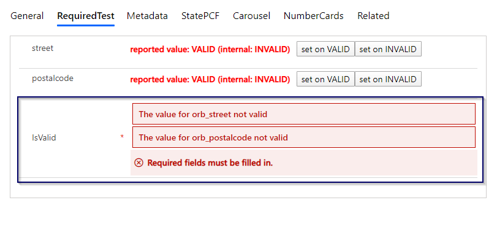
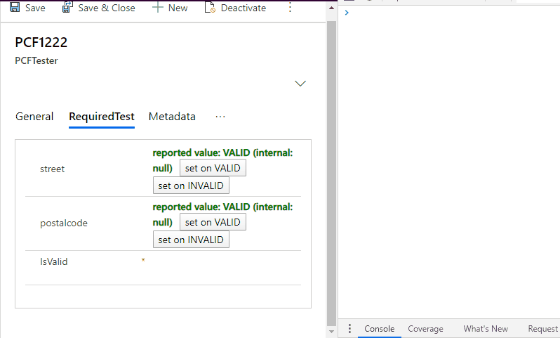
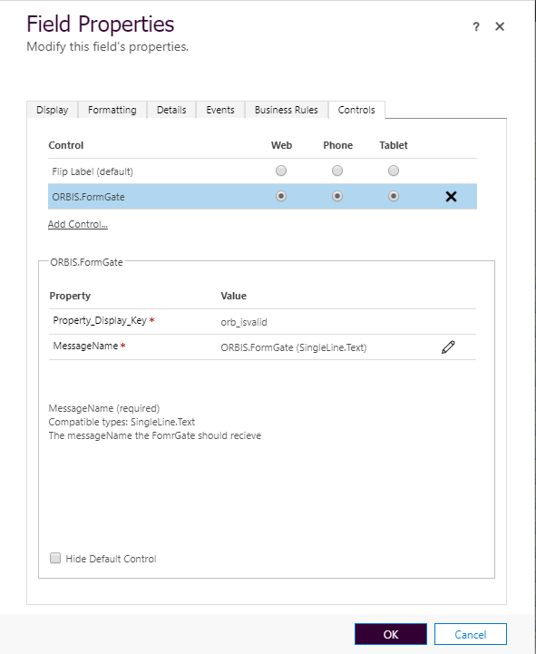

# FormGate PCF

This is a PCF (PowerApps Component Framework) component. Unlike the most PCFs, the main functionality is not helping to work with the attributes. 

This is a technical PCF, which helps **to stop the form saving**.

It has to be registered on a boolean **required** attribute.
The other pcfs on the from can send messages to the FormGate PCF. 
The FormGate will receive the messages, delete or set the value of the required field, and show the error messages received.

# Control Preview


In the image below, the FormGate PCF is shown in the blue box. The ugly PCFs above are just test PCF for sending the "valid" or "invalid" messages.


# How it works
In the image below, you can see how the send Messages works (sending the messages by typing them in the console)


# Message content
The PCF will recieve messages sent using window.postMessage.
The structure of the data sent must me:
```javascript
{
   messageName: "ORBIS.FormGate",
   fieldName: "field1",
   isValid : false, 
   errorMessage : "Have you checked your field 1"
}
```
- messageName: this is the name of the message, telling the FormGate that this message is intended to be received by it. 
- fieldName: is a kind of key. Each sender must have a unique name (attributeName is a good fieldName). This way the FormGate will know to keep the messages apart.
- isValid: if set to false, the FormGate will know to delete it's own value, which will stop the saving (since the attribute is required).
- errorMessage: the message will be shown to the user.

The name of the **messageName** can be changed in the customizing. The default is "ORBIS.FormGate".

The content of the function used in the demo:
```javascript
function sendField1Invalid(){
   window.postMessage({
				messageName: "ORBIS.FormGate",
				fieldName: "field1",
				isValid : false, 
				errorMessage : "Have you checked your field 1"
			}, window.location.href)
}			
			
function sendField2Invalid(){
   window.postMessage({
				messageName: "ORBIS.FormGate",
				fieldName: "field2",
				isValid : false, 
				errorMessage : "It's a sunny day, but let's provide a valid input"
			}, window.location.href)
}			
			
function sendField1Valid(){			
   window.postMessage({
				messageName: "ORBIS.FormGate",
				fieldName: "field1",
				isValid : true, 
				errorMessage : null
			}, window.location.href)			
}			
			
function sendField2Valid(){
   window.postMessage({
				messageName: "ORBIS.FormGate",
				fieldName: "field2",
				isValid : true, 
				errorMessage : null
			}, window.location.href)				
}	
```

# Setup

To use the pcf, open the field properties in customizing, chose "Controls" and add the "ORBIS.FormGate" to the form.


You can directly download the solution from the [Releases](./EvaluatePCFRequiredField/releases).

# Repository content

The repository has 2 Projects.
- ConsumerPCF is just a dummy PCF to send messages using window.postMessage.
- FormGatway contains the code for the actual component.

The solutions in the release folder are only for the FormGate pcf.


